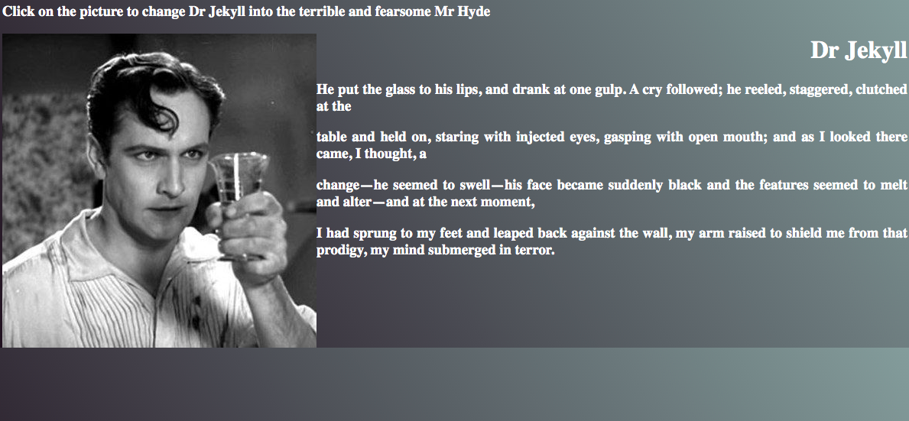

# Single-page frontend app

## Description

A single page, simple application. Click on the picture of Dr Jekyll to transform him into Mr Hyde.

## Getting started
```
$ git clone https://github.com/emilyjspencer/Single-page-frontend-app.git

cd into the newly created repository

$ open .index.html 
```
## Screenshots

Dr Jekyll                  |  Mr Hyde
:-------------------------:|:-------------------------:
  |  
